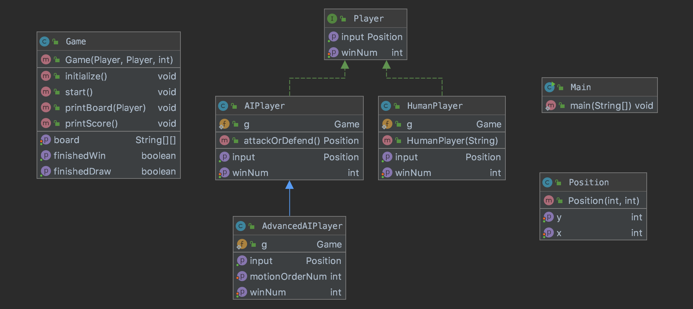
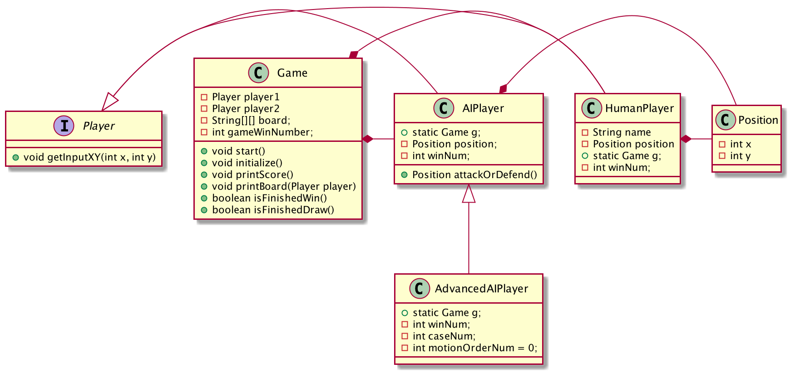

# TIKTEKTOE PROJECT

## UML

- HumanPlayer and AIPlayer implement interface Player
- AdvancedPlayer extends AIPlayer

## Game process

1. choice mode 
    - Player vs Player mode is number 1
    - Player vs AIPlayer mode is number 2
    - Player vs Advanced mode i number 3
1. If player is human, input name
1. Set count of win to finish the game
1. Play

## Playing Type
1. vs HumanPlayer
    - play with another human player
1. vs AIPlayer
    - play with AI 
    - AI check your input
1. vs Advanced AIPlayer
    - Advanced AI will win and draw
    - AI never lose

